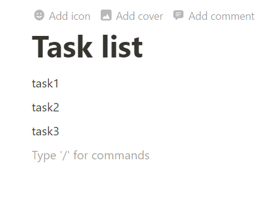

# connect_todoist_notion
When you enter a task on the notion page and run the application, the task will be reflected in todoist.

## Features
- Automatically and batch add tasks to Todoist via running the app.
- Manage tasks on Notion for editing on any device.

## Version
- python 10.3.4
- todoist-api-python 2.0.2
- notion 0.0.28

Obtaining tokens is left for experts.

### Creating a Notion Page
Create a page as shown in the following image, with one block of tasks corresponding to one task.

### Recommendation
Using PyInstaller to make it an exe file is recommended.

## Cautions
1. Print statements are in Japanese. 
2. Code and function descriptions are in English. 
3. If releasing modified code to third party, be careful with the tokens.
